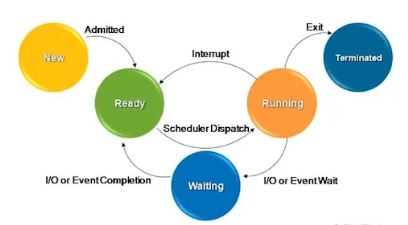

# Process Control Block

## With multiprocessing, OS must keep track of processes
### For each process, a process control block(PCB) holds
- Execute state(saved registers, etc.)
- Scheduling information (priority)
- Accounting and other misc. information (open files)

### System-wide table of PCB
- Process table
 >> OS 내부에 system-wide하게 존재하는 process control block들의 array

### UNIX
- Fixed-size array of PCB's

### Program = Data Structure + Algorithm

## Process state of context
### Collection of three types of contexts
- Memory context
 + Code segment data segment stack segment heap

- Hardware context
 + CPU registers I/O resgisters
 
- System context
 
 
 
# State Transition (1)

## As a process executes, it changes state
### New
- Process is being created

### Running
- Instructions are being executed

### Waiting 
- Process is waiting for some event to occur

### Ready
- Process is waiting to be assigned to CPU

### Terminated
- Process has finished execution

# State Transition (2)

## State transition diagram

1. new 되면 Ready로 들어감
 - Ready : active한 process 인데 아직 cpu를 할당받지 못해서 수행하지 못하는 상태
 - 여러개의 Ready상태가 존재함
 - Ready 상태의 프로세스를 큐로 묶어서 ready Queue(ready List)라고 부른다
 - Ready queue의 각 node는 PCB 를 사용함 (PCB를 Linked List로 구현해서 Ready queue 구현)
 
2. OS에게 CPU할당 받고 수행하게됨 (Running 상태)
 - 0개 or 최대 1개의 Running State가 존재
 
3. Running 에서 I/O Request를 해서 입력 data가 들어올 때까지 기다려아함
 - Waiting 상태로 전이
 - 어떤 event 가 발생하기를 기다리기 때문에 cpu를 주고 이동되어있는 상태
 
4. data 가 도착하면 waiting 상태에서 ready 상태로 돌아감
 - waiting 상태에서는 여러 process가 존재할 수 있음
 - waiting의 목적은 process 별로 다를 수 있음 (목적별로 큐를 다르게 사용)
 
>> OS 란 process가 생성되면 여러자원들과 'PCB' 를 하나 할당하고 해당 프로세스를
   일련의 조건에 따라서 다른 상태로 전이시키는 것 !
   
5. Ready에서 Runnig으로 오려면 OS Scheduler가 수행됨

6. Running에서 Ready로 가는 경우
 - 수행되다가 interrupt 발생해서 cpu를 빼앗기는 경우 (preemptive scheduling)
 
7. Waiting으로 가는 경우
 - 어떤 process 가 I/O나 waiting 하는 함수 호출
 
8. Waiting에서 Ready 로 가는경우
 - 자기가 원하는 event가 발생하면 돌아감

### 프로세스의 생명주기 (Prcess Life Cycle)
- 프로세스가 생성되었을 때부터 종료될 떄 까지 발생하는 일련의 상태 변화

# State Transition (3)

## State transitions and sceduling queues
### Queues at different states
 - Ready queue
  + Set of all processes residing in main memory, ready and waiting to execute
  
 - Device queues (I/O Wating queues)
  + Set of processes waiting for an I/O device
  
### State transition
 - Migrating processes between various queues
