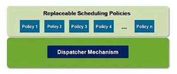

# Process Scheduling

## Goal
### For several processes to share a CPU, OS mush select a process to run next

## Constraints
### OS must have
 - Fair scheduling
  + Make sure each process gets a chance to run
  
 - Protection
  + Making sure processes don't trash each other
  
  

# Scheduler Design Priciple
 - Fairness 라는 목적을 갖고 cpu를 여러 process간 share 하게함
   (어느 process에게 cpu를 넘겨줄까?)

## Process scheduler design by system design principle
### Separation of policy and mechanism
 - Separation of scheduling policies and dispatching mechanisms
 
 1. Policy : 다음에 수행될 프로세스를 선택하는 기준 (Scheduling Policy)
 2. Mechanism : cpu를 한 프로세스에서 다른 프로세스로 넘겨주는 방법 (Dispatcher)
 
 - ex) 자동차 운전할 때 어느길로 갈 것인지가 policy이고 운전의 기계적인 요소가 mechanism
 
### Leads to two-level architecture

# Dispatcher(1)

## Inner-most portion of OS that runs processes
 - Dispatcher는 OS의 가장 깊은 곳에서 해당 무한 루프를 돔
 
 loop forever{
 
  run the process for a while
  stop it and save its state
  load state of another process
 
 }
 
 
# Dispatcher(2)

 - program은 passive하고 process는 active하다

 - OS active해 보이지만 실제로는 passive한 entity 이다
 
 - 하지만 Dispatcher는 OS의 일부분인데도 위 무한루프처럼 능동적으로 표현되어있음
 
 - dispatcher가 한 process를 run 시키고 stop시킨 후, 다른 process 를 돌릴 수 있도록
   하는 방식을 구현하기 위해서 cpu가 2개 필요하다 
   -> "Dispatcher만 도는 cpu와 process가 도는 cpu"
   
## Challenges   

 1. How does the dispatcher keep control?
  - CPU can only be doing one thing at a time
  - User process running means that dispatcher isn't
  
 2. Which process is executed next?
  - Need to locate runnable processes efficiently
  
 >> Solution은 User process와 OS가 Interleaving하게 동작해야함
   

# 1. Entering and Leaving and Kerner(1)

## How does the dispatcher regain control?
 (= 어떻게 control이 user에서 dispatcher로 넘어가는가?
  = 어떻게 kernel로 들어가고 나오는가? )
  
### Trust the process to wake up the dispatcher
 - On a voluntar basis - "non-preemptive" way
 - Problem : Sometimes processes misbehave
 
 
### Provide the dispatcher with an alarm clock
 - On a compulsory basiss - "preemptive" way
 - Timer hardware and interrupts (hw 메커니즘)
