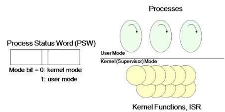

5 Processes and Thread(2) - Process Implementation
===================================================

# Entering and Leaving the kernel(2)
## Misconceptions about kernel
### Like a user process, Kernel is an active and independent entity possessing a thread of control

### Kernel is continuosly monitoring user processes while they are running

## In reality,
### Kernel is a 'passive entity' consisting of kernel functions and interrupts service routines

### Kernel is like a library
 - kernel mode에서 수행되는 라이브러리(함수들의 콜렉션)이다

# Entering and Leaving the kernel(3)
## Kernel is a collection of functions running in kernel space

### Non-preemptive scheduling
 - 프로세스가 자발적으로 cpu를 양보하여 다른 프로세스를 수행시키는 스케줄링
 - SW Interrupt(Trap)에 의해서 발생
 - Trap : 스스로 cpu를 yield하는 process가 'SW interrupt'를 야기시키는 instruction을 수행시키면 됨
   -> mode change 발생하고 해당 handler에 의해서 dispatcher 가 수행될 수 있게됨

### preemptive scheduling
 - os가 강제로 프로세스로부터 cpu를 빼앗아 다른 프로세스를 수행하는 스케줄링
 - HW Interrupt에 의해서 발생

# Entering and Leaving the kernel(4)
## Kernel space (mode)
### 'Elevated system state' compared to normal user applications
 - Protected memory space
 - Full access to the hardware

### System state + memory space

## User space (mode)
### 'Restricted system state' compared to the kernel
 - A subset of the machine's available resources
 - Limited privilege
  + Unable to perform certain system resources
  
### Restricted system state + restricted memory space

# Entering and Leaving the kernel(5)
## Execution modes in protected MMU machine

###  kernel 함수
 - System call
  + OS의 커널이 제공하는 서비스를 응용 프로그램이 이용하기 위한 Interface
 
 - Interrupt Service Routine
  + Interrupt 가 걸리면 mode change가 일어나고 hw적인 정의에 의해서 해당 isr이 불려짐
  + 이 ISR 이 불려졌을 때 모드는 kernel mode 이다

### 프로세서가 커널모드와 유저모드를 구분하는 방식
 - 프로세스 Status Word 레지스터 안의 특정 bit를 Mode bit로 사용한다
 - Interrupt가 발생하면 hw적으로 process status word 가 1이건 0이건 무조건 0으로 설정됨
 
 

# Entering and Leaving the kernel(6)
## Dispatcher is a kernel function after all

## Control returns to OS on
### Traps : event internal to user processes
 - System calls
 - Errors (illegal instructions, address error, etc)
 - Page faults
 
### Interrupts : Events external from user processes
 - Character typed at a terminal
 - Completion of a disk transfer
 - Timer to make sure OS eventually gets control

# Entering and Leaving the kernel(7)
## Mode change of process
- sw interrupt(Trap) 중의 일부분을 system call이라고 함

 
 1. Read() 라는 kernel service 가 필요하여 read() system call 호출
  
 2. read() 함수 안에서는 file read가 아니고 interrupt를 발생시킴
  - 그 interrupt의 인자로 'kerenl의 read함수호출 요청' 정보를 보냄
  
 3. mode change 발생하고 kernel mode execution 발생
  - kernel mode execution 안에서 system call 함수인 sys read() 함수가 호출 되어짐
  
 4. return 하면 다시 user mode로 돌아감
  - mechanism 필요 없고 return for interrupt 라는 instruction으로 리턴
  - 보안등급이 강력한 상태에서 보안등급 낮은 상태로 이동하는 것이므로 제한할 필요가 없다
  
 Q. Kernel Mode Execution이 일어날 때 수행의 주체가 되는 프로세스는?
  >> System Call을 호출한 User Process (현재 수행중인 process ID는 같은 놈이다 !!)
  >> Mode change가 되어도 Process가 change 되는 것은 아님

### Process ?
 - State (Context) + Thread of Control (Execution Stream)
 
 - Thread of Control : 프로세스가 첫 instruction을 수행시킨 시점부터 지금까지 수행된 sequence 들
 
 - function : 여러 Instruction sequence 들을 묶어서 하나의 이름으로 부르는 것 
            (Instruction sequence의 Abstract한 표현)
            
 - 수행 Instruction 의 sequence는 runtime의 'stack' 을 검사하면 알 수 있다
 >> stack 은  State가 아니고 Thread of Control을 구현하는 자료구조라고 생각한다 !
 >> 그 stack의 값들을 "그 process의 runtime context" 라고도 부름
 
 - 프로세스가 User Mode에서 수행될 때는 User Mode stack을 사용하고,
   Kernel Mdoe에서 수행될 때는 Kernel Mdoe Stack을 사용한다
   >> Run-time Context(Stack)가 변화한다
   >> 수행중인 현재 프로세스 ID는 동일하다 !

# Entering and Leaving the kernel(8)
## System call vs Function call
### Common properties
 - Transfer control to another routine
 - Maintain the context of the process
 
### Differences
 - Syscall incurs mode change but function call doesn't
 - Syscall is more expensive than function call
