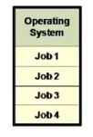
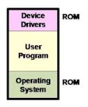
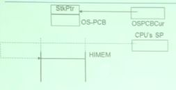
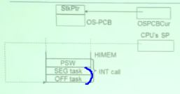
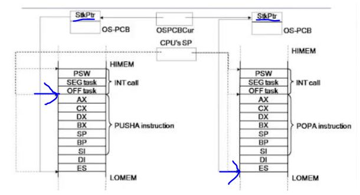
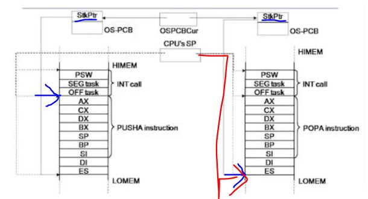
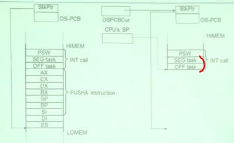
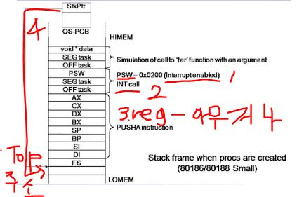

# Scheduling Policy
## Once dispatcher gets control, how to decide who's next?
### Possibilities
- Scan process table for first runnable process:
 + Might spend much time searching
 + Results in weird priorities : Small PIDs better
 + Questions: How do you know a process is runnable?
 
- Run together the runnable processes into a queue
 + Dispatcher takes from the head of the queue
 + Runnable processes are inserted at back of queue
 + Called "ready list" or "run queue"
 
- Assign priorities to processes
 + Keep the queue sorted by priority
 + Separate queue per priority
 
## Who decides priorities and how are priorities chosen?
### Who ?
- Separate part of OS : the scheduler

### Question: Why not by the dispatcher?
- Concept : Separation of policy and mechanism

### How ?

Context Switching
=================

# Context Switching 이란?
- 현재 수행 중인 프로세스의 State를 저장하고 다음 수행될 프로세스의 State를 불러오는 작업

## Process State 용어의 2가지 의미
 1. Process가 기억하는 모든 정보 (context)
 2. process의 현재 상황(state transition)

## Process State 종류 3가지
 1. memory에 쌓아놓는 state (data, code, stack, heap) : memory context
 2. cpu resigters, i/o controller의 register value들 : hw context
 3. os가 해당 process를 위해서 내부적으로 kernel memory에 담고 있는 정보들 : kernel(system) context

## How does the dispatcher save and restore state?
### Mechanism : context switch

## What mush get saved?
### Everything that next process could or will damage?
 - Program counter
 - Processor status word (condition codes, etc)
 - General purpose registers, floating-point registers
 - All of memory?
  + Swapping
   > Memory could be large so saving it could be expensive
   
   
### Possibilities:
 1. Don't save memory
  + No dynamic memory management
   > Memory is allocated to entire batch
  + Old batch processing system : multiprogrammed batch monitor
  + Context switching in multithreaded process
  
  
  
  
 2. Save all memory to disk(roll-in/roll-out swapping)
  + Bringing in each process entirely, running it and then putting it back on the disk,
    so that another program may be loaded into that space
  + Early personal compute/workstation : DOS
  + Effective but very slow
  + unit programing에 필요함 : 메인 메모리에 하나의 프로세스만 수행시키다가 cpu를 빼앗기게 되면,
    disk에 나가게 되고 디스크에 있던 새로운 process가 메인 메모리에 들어옴 
    -> 느림
  
  
  
  
 3. Save part memory to disk(swapping)
  + Moving memory blocks of process between RAM and disk
   > Swap file, swap device
  + Implemented with memory complex management mechanisms
  + Used in most of the modern OSes
   > UNIX or UNIX-like systemss : Linux, OS X
   
  + 메모리 안에 너무 많은 active process가 있을 때(degree of multi programming이 너무 클 때) 사용
  
 >> cpu register(hw context)는 반드시 switching / memory는 필요한 경우 부분적으로 / kernel context는 두자

 Q. cpu register도 Disk로 대피시키는 것인가?
   -> 일반적으로 한 단계 아래의 저장 장치로 데이터를 대피시키기 때문에 CPU Register는 Main memory로 대피시킨다
   -> 대피시킨다 = memory hierarchy의 다음단계로 보낸다(cache는 속성이 다른 메모리)
   
   
   
# Implementation
## Machine dependent
### Different for MIPS, SPARC, x86, etc.

## Tricky
### OS must execute code to save state without changing the process' state

## Require some special hardware support
### Example : Save PC and PSR on trap or interrupt

# Mechanism(1)

1. 

- OS-PCB(global) : OS 는 OS 변수라는 것을 뜻하고 PCB는 process control block

- CUR(global) : 현재 수행되고 있는 프로세스의 PCB를 가리킴
  >> 현재 수행중인 프로세스의 PCB 에 대한 포인터를 OS가 변수에 넣어서 가리키고 있음

* PCB : 1.프로세스 식별자 2.스케쥴링 정보 3.context switching 에 필요한 정보(stack pointer field)

2.Interrupt 발생

- micro processor가 process state word 를 hw적으로 stack에 저장

- 현재 수행중인 Instruction의 return주소(PC에 있음)를 stack에 저장
  >>2개의 word 주소가 저장(2개가 하나의 return address)
  >>Intel process의 segmented addressing 때문에 필요(중요치 않음)

3. 해당 ISR로 JUMP

- ISR 초반에 STACK에다가 해당 process의 cpu register 값들 전부 대피시킴 (context를 saving)

  (Intel processor는 이 과정에 push all이라는 instruction 있음. push all로 안들어가는건 별도로 push)
  
  * 대피 안하고 ISR의 main로직 바로 처리하면, 이미 ISR안에서 CPU 레지스터 값들 다 오버라이드 되어버림
  
- stack pointer regsiter 값이 밑으로 이동함

4. 기록된 regiter 값들 중에서 Stack Pointer register value(SP)가 save 된 이후에도 push가 계속되면

    stack pointer 가 변화함 -> SP는 제대로된 value가 아님(여기에 저장 못함)
    
    -> PCB에 제대로된 Stack Pointer에 저장함 (이 Stack Pointer의 실제 value가 제대로된 곳을 가리킴)
    

5. OS Scheduler가 다음에 돌아야할 process를 확인하고 그 process의 PCB Pointer를 얻고
   해당 포인터를 자기의 Current process 포인터 변수에 기록함
   
   
6. 새로운 Process로 메커니즘 진행되면 기존 프로세스랑 똑같은 모습의 stack이 있음
 
 - 새로운 PCB의 Stack Pointer값을 가져와서 Stack하단부 가리키게함
 
 - 그 다음에 pop : 새로 수행될 process의 context(memory register 값들)가 cpu register로 들어오게됨
 

7. 새로 들어온 process가 interrupt 당했던 주소로 Back 

 - Return From Interrupt 

Q. ARM 프로세서처럼 Link Register가 별도로 존재하면 Memory에 리턴 주소를 저장하지 않아도 되는가?
A. 그렇다. 개념적으로 리턴주소를 다른 곳에 저장해야 하지만 마이크로 프로세서에 따라 저장위치는 달라질 수 있다.

Q. PUSHALL이 꼭 필요하다면 HW가 직접하면 되지 않는가?
A. 프로그래밍 상황에 따라 일부 레지스터는 대피하지 않아도 되는 상황이 발생할 수 있기 때문에 SW적으로 구현한다 
   
   
8.  Mechanism이 한가지 예외 상황    
- Process는 적어도 한번 context switching 당했어야함 but 처음 프로세스 만들어진 경우는 안당했음

- 생성된 프로세스의 STACK을 마치 context switching 당했던 것처럼 만들어줌
   
 

* Stack은 메인 메모리 아무곳에나 존재할 수 있음
 - 프로세스 별로 전부 한개씩 따로 갖고 있음
 - avtive한 stack은 1개임 !

   
<Result>
1. OS의 스케줄러는 specific Policy와 common mechanism이 있다
2. mechanism이 context swtiching을 담당하는 dispatcher이다
3. dispatcher가 수행되려면 process와 process 사이에 mode change가 일어나서 수행되어야한다 !!
