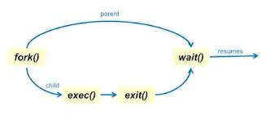

# Process Creation
## Creating new processes:
- Build one from scratch (EX : UNIX Process 0)
- Clone an existing one (EX : UNIX for() syscall)

## From scratch
1 Load code and data into memory
2 Create (empty) call stack
3 Create and initialize a process control block
4 Put process on ready list

## Cloning : Unix fork() system call
1 Stop current process and save its state
2 Make a copy of code, data, stack, and PCB(process ID 제외하고 다 copy)
3 Add new PCB to read list
 + Not quite right. What's missing?
 
### Parent Process : Process Cloning을 초래하는 기존의 Process
- Child Process : Parent Process로부터 만들어지는 새로운 Process

### Fork() System Call이 가지는 문제점?
- 매번 모든 Context을 복사본을 만드는 것은 매우 비효율적이다
- 맨 처음 만든 process와 다른 process는 수행할 수 없다

## Process creation in UNIX with fork() and exec() 
- exec() : Parent와 Child가 다른 process 수행가능해짐

## Process life cycle in UNIX

  
- OS가 exit() 시스템 콜 호출해서 process 종료시켜줌
- exit() 
    + process가 갖고 있던 data structure, resource 들을 걷어가는 과정
           
    + exit 결과에 관한 code값 남겨둠
           
    + 그 code 값을 waiting하고 있는 parent process에게 signal로 전달함 
           
### Zonbie State
- exit()을 마치고 Parent Process가 자신의 Exit Status를 읽어가기를 기다리는 Process 상태
