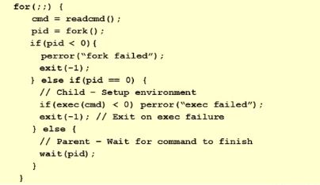
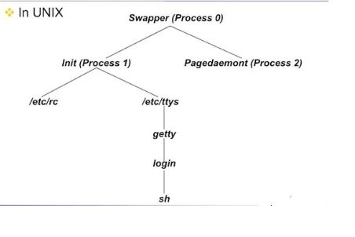

# Prcocess Creation
## Shell example
 
### Shell 또는 CLI(Command Line Interpreter)
 
 - 사용자가 입력한 명령어를 입력으로 받아들여 새로운 프로세스를 수행시키는 프로그램
 
 
 
 
 - fork() : cmd를 수행시킬 child process 만듬
 
 -  이 시점에서 process 수행이 중단되고 context의 snapshot이 찍힌 후 child process에게 복사됨
            
    child process의 PCB가 생성되고 이게 READY QUEUE에 들어감
            
    결국 child process의 PCB가 선택되서 스케줄링 받아서 수행됨
            
    "child process는 동일한 코드 수행하게됨" parent 꺼 copy 했으니까..
    
    (parent의 코드 중에서 fork() 다음부터 수행하게됨 -> system call 호출되어 sw interrupt 발생하면
    
    return address가 stack에 들어감. 이 address가 fork() 다음으로 지정되어 있음)
    
    
-   child process에게 return할 때는 return value를 0으로 설정해놓음

    return value는 보통 cpu register를 통해서 넘기는데 cpu register값이 stack에 저장되어 있음.
    
    return value를 담고있는 register가 저장된 stack field에다가
    
    parent process이면 child의 pid를 넣고, child process이면 0을 넣는다.
    
    child process가 수행된적 없어도 fork() 다음으로 수행되고,
    
    return value(pid) > 0 이므로 child는 exec를 하게됨
    
    자기가 수행시켜야할 executable file을 argument로 해서 exec() 호출함
    
    
-   child process는 동작하게 되고, 종료되면 exit()호출되고 parent로 signal 전달.

    parent깨어나고 prompt 떨어짐 !
         
 
- System call 호출해도 return값 있음 ( return < 0 이면 에러, return >= 0 이면 정상 동작 )
 
- pid : return 의미함. pid는 프로세스의 ID임
 
- pid > 0 이면 child process가 끝날때까지 wait 함. 이후에 다음 프롬프트가 떨어짐
 
 
 
 
 
Q. Child Process의 pid는 0이 아니고 다른 값인가?
A. 그렇다. Parent에게 넘기는 system call return value로는 실제 부여받은 pid(positive value)이고
   Child Process에게 전달되는 fork() System call의 리턴 값이 0이다.
   
   >> Parent와 Child를 구분할 수 있는 유일한 방법
   
Q. fork()함수로 받는 리턴값이 0인 것은 Process 0번의 PID를 받는다는 의미?
A. 아니다. 0은 사용되지 않는 숫자이니까 "child 로 리턴된것이다 " 라는 의미를 주기위해 쓰는 것임

Q. Parent Process가 항상 wait()를 하게 되면 시스템에는 항상 한 개의 Process만 동작하는 것이 아닌가?
A. 아니다. Parent Process가 언제나 fork()후에 wait()를 호출해야 하는 것은 아니다.
    wait는 다른 일 더 해놓고 wait 해도 된다.
    
Q. Child Process들이 다 종료될 때까지 Parent Process가 wait()하고 있어야 하는가?
A. 아니다. Parent Process가 Child Process의 종료 상태에 관심이 있는 경우에만 wait()를 호출한다.

* 왜 UNIX 계열에서는 fork()를 통해서 process를 생성하고 종료하는가?

- 교수님 추측으로는,

- 모든 Process는 독자적인 Logical Address Space를 갖는다

- 초창기 UNIX에서는 process간 communication 방법이 fork()방법밖에 없었고

  당연히 Parent Process와 Child Process만 서로 통신이 가능했다
  
  따라서 처음에 UNIX만든 사람들이 기존의 메커니즘으로 IPC 문제를 비교적 간단히 해결하기 위해서
  
  FORK() EXEC() 매커니즘을 개발함. 너무 ABUSING해서 모든 곳에 다 쓰이고 있음 
 

* fork()의 성능을 어떻게 극복하는가?

ex).Parent의 code, data를 copy했는데 바로 exec()으로 오버라이드 되는 문제 어떻게 해결??

- COW ( Copy On Write ) : 

    Process Context를 fork() 시점에 복사하지 않고, 
    
    Data Segment에 새 값이 쓰여질 때 복사하는 기법

    실제 내용 복사하지않고 Pointer Data Structure만 만들어서 자기의 code, data structure를 child가 pointing 하게함
    
    parent나 child가 결국 data segment에 새 값을 기록하면 그때 실제 copy 발생
    
    (하지만  그 전에 child process가 exec()해서 pointer를 없애고 새로운 code를 read할 것임)
 
    

## Process Termination

### 방법1. Process executes last statement and asks the OS to decide it ( exit() )
- Output data from child to parent(via wait())
- Process' resources are deallocated by OS

### 방법2. Parent may terminate execution of children
- Child has exceeded allocated resources
- Task assigned to child is no longer required
- Parent is exiting
 + OS does not allow child to continue if its parent terminates
 + Cascading termination
