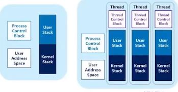

# Multi threading (1)

## Server Architecture
1). Iterative Server 방식
- 서버가 메세지 큐에서 요청받고 스스로 처리함

2). Concurrent Server 방식
- 메세지 큐에서 요청받으면 처리할 worker process(child)를 하나 fork함

- 서버 프로세느는 서비스로부터 자유로워지니까 또 요청 받음

- 병렬적임

- 처리할 요청 수 만큼 프로세스를 생성해야 하기 때문에 시스템에 부담 발생

* 'Architecture' 는 시스템 전체 설계에서 사용되는 디자인 패턴

## Multi threading의 목적
- Concurrency는 높이면서 Execution Unit을 생성하거나 수행하는데 드는 부담을 줄임

## Traditional Process Model
### Two characteristics in one process
 + Unit of resource ownership
  - Assigned virtual address space to hold the process image
  - Has the control of some resources (files, I/O, devices...)
  
 + Unit of dispatching
  - Has a thread of control
  - Has execution state and dispatching priority
   >> Process execution may be interleaved with other processes
   
### How about separating the two?
 - 왜 하나의 process 안에 한개의 thread of control 만 있어야 해!!??
 
 
## Multithread Process Model
### Most modern OSes treat these two characteristics independently
 + Unit of resource ownership is usually referred to as 'process' or 'task'
 + Unit of dispatching is usually referred to as 'thread' of 'lightweight process'
 
 하나의 프로세스에게 부여되는 하나의 자원을 여러 쓰레드들이 공유하는 형태로 진화
 
 
## Multithreading : Basics(1)
### Characteristics of threads
 + Has an execution state (running, ready, stopped)
 
 + Saves thread context when not running
 
 + Has an execution stack and some per-thread static memory for local variable
 
 + Has access to the memory address space and resources of its process
 
  - All threads of process share this
  - When one thread alters a (non-private) memory item, 
    all other threads (of the process) see that
  - A file opened by a thread is available to others

 + Thread 구현을 위해 필요한 자료 구조
  - Stack, Thread ID, Thread Control Block(TCB)
  
  
## Multithreading : Basics(2)
### Single threading vs multithreading

  
  
- multi threading에서 stack 나눠져 있음 : system call 에 따라 user / kernel 함수 수행할 때 다름

## Multithreading : Basics(3)
### Various thread supports in OS
 + MS-DOS supports a single user process and a single thread
 
 + Old UNIX supports multiple user processes but only supports one thread per process
 
 + Solaris supports multiple threads

## Multithreading : Basics(4)
### State transition of threads
 + Three key states
  - Running, ready, blocked
  
 + They have no suspend(i.e., swapping) state 
 because all threads of the same process share the same address space
  - Suspending a single thread involves suspending all threads of the same process
  
 + Termination of a process terminates all threads within the process

* Design time 에서 Task : 독립적으로 수행 및 구현 가능한 entitiy들을 의미함

  Runtime 에서 process : OS가 자원을 할당하고 수행시키는 주체들
  
  Runtime entity들이 더 세분화되면 쓰레드 존재

* Linux에서는 user level 에서는 쓰레드, 프로세스라고 부르고

 kernel 모드에서는 실제로 구분하지 않는다 ->kernel이 바라보는 entity들 전부 task라고 부른다
