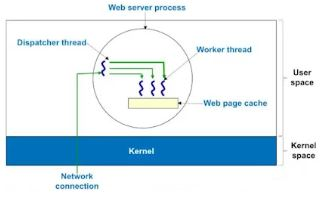
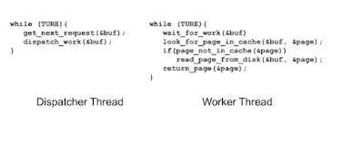

# Multi threading (2)

## Multithreading이 필요한 이유

1 적은 비용으로 Concurrency를 얻기 위함 -> response time을 줄이겠다

2 Massively Parallel Scientific Programming을 할 때 발생하는 오버헤드를 줄이기 위함

## Why Multithreading? (1)
### Effective concurrent programming (original goal)
 + Straightforward mapping from threads onto multiprocessors
 
### Resources sharing
 + Can pass data via shared memory
  - No need for IPC
  - Need to synchronize the activities of various threads so that they
    do not obtain inconsistent vies of the data
     
### Economy - cheap to implement
 + Takes less time
  - To create a new thread than a process
  - To terminate a thread than a process
  - To switch between two threads within the same process
  
 + Uses very little resources
  - Stack and per-thread static memory
  
### Agility in responses (good for reactive systems)
 + Concurrent server architecture for interative applications
  - A process has one server thread and multiple worker threads
   > Even if one worker blocks, possibly on a read, 
     others still continue executing and produce outputs to users
   

### Multithreading fits for concurrent server architecture

 - Server 구현을 위해 process 1개 존재
 
 - 그 Process는 input request queue에서 request를 가져올 수 있는 dispatcher thread 갖고 있음
 
 - 나머지는 필요에 따라 worker thread를 생성하고 수행시킴
 

### Concurrent server architecture

### Multithreaded Web Browser

 - 반응 속도 증가

