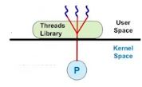
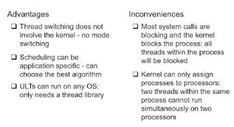
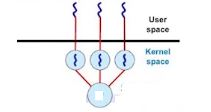
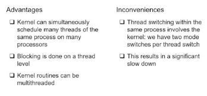
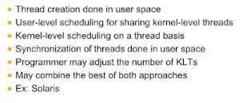

# Multi threading (3)

- User-level / Kernel-level / Combined User-level, Kernel-level

## Threads Implementation : User-Level Threads
### Key entities
 + Threads :
 
  - 100% use-level entity
  
  - kernel is not aware of the existence of threads
  
 + Threads library
  - User-level library linked to processcode
  
  - Contains code for
   > Creating and destroying threads
   > Scheduling thread execution
   > Saving and restoring thread contexts
   > Passing messages and data between threads
   
   
   
   

 + Processor
  - Allocation on a process basis
  
 + 구현 :
  1. stack을 여러개 구현
  
  2. thread control block을 각 thread 마다 생성 (in.user level)
  
  3. thread 간 switching(스케줄링)을 위해 scheduler가 있어야함
    >> 원래 kernel level에 있었음
    >> 구현 방식은 kernel 것과 비슷. 함수로 구현하고 그 함수들을 묶어서 library로 만듬 : Thread Library
    
  
### Characteristic
 + Application does all thread management via threads libray
 
  - Thread switching does not require kernel mode privileges
 
  - Scheduling is application-specific
  
 + Kernel activities
  
  - Kernel is not aware of thread activity but still manages process avtivity
  
  - When a thread makes a blocking system call
   >> The whole process will be blocked
   >> For the thread library, that thread is still in the running state
   
  단점 1. Kernel이 Multithreading의 존재를 몰라서 한 thread가 blocking system call을 한다고 해도
  
   Process 가 blocking 을 했다고 생각해서 process의 모든 Thread를 block 시킴
   
  단점 2. OS가 Thread에게 직접 Interr upt를 전달할 수 없기 때문에 Preemptive Scheduling을 할 수 없음
   
  - Implication :
   >> Thread states are independent of process states
   
  
  <장단점 정리>
  
  
  
   
   
   
## Thread Implementation : Kernel-level Thread
### Key entities
 + Thread:
 
  - Both use-level and kernel-level entity
   >> 1 to 1 mapping between user-level and kernel-level thread
   
  - Kernel is completely aware of the existence of threads
  
 + System call API and kernel functions for thread facility
 
  - Code for
   > Maintaining context information for processes and threads
   > Switching between threads
   > Scheduling threads
   > Synchronization
   
 + Processor
  - Allocation on a thread basis
   
   
 + Task 생성과 소멸을 kernel 함수(system call)로 구현
 
 + Interrupt forwarding 가능해지고 user-level Thread 에서의 blocking 문제도 해결
   
   

### Characteristic
  + No thread library but an API to the kernel thread facility
   
   - Need kernel modification
   
  + Scheduling on a thread basis
   
   - kernel-level threads are scheduling entities
   
  + EX: Windows NT and OS/2

  단점 1. Kernel 단의 수행 시간이 증가하면서 추가적인 오버헤드가 발생함
   
   
  <장단점 정리>
  
  
  
  

## Thread Implementation : Combined UL/KL Thread
### Key entites
 + User-level thread
  - Kernel is mostly unaware of the existence of threads
  
 + Kernel-level thread
  - Serves as virtual processor to user-level threads
  - Schedulable entity
  
 + Threads library
  - Contains code for
   > Creating / destroying user-level threads
   > Scheduling thread execution
   > Saving and restoring thread contexts
   > Passing messages and data between threads
  

### Characteristics
   

   
   