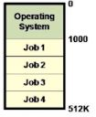

# Phase 1
## Active Job
- 수행시작했지만 아직 종료되지 않은 상태의 프로그램

## Multiprogramming
- 컴퓨터 시스템의 메인 메모리에 동시에 여러 개의 Active Job이 존재하는 것

## Multiprogrammed batch monitor
- Several users shared the system
>> Degree of multiprogramming >= 1 ( 현재 메인 메모리엑 존재하고 있는 Active Job의 개수)

- OS became a focus of study
>> Memory protection and relocation added to OS
>> Higher utilization because of multiple jobs
>> Concurrent programming became necessary

    
## Multiprogrammed Batch Monitor의 등장 배경과 새롭게 대두된 3가지 문제들
- 등장 배경 : 동기적 I/O로 인한 CPU Utilization 저하 문제를 해결하기 위해 
            Multiprogramming 을 지원할 필요가 생김
- 문제점 : Memory Protection, Memory Relocation, Concurrent Programming

## 1. Momory Protection

- 어떤 job의 주소 사용 버그로 인해 다른 job이나 OS의 영역을 침범함으로써
  문제를 일으키는 현상을 방지해야 할 필요성이 대두됨

  
  
  >> Job1이 수행중에 Job2의 메모리영역을 오버라이드 해버리는 문제 발생
  
  >>"어떤 Job이 포인터를 통해 메모리에 접근할 때, 그 target 메모리가 해당 job에게 부여받은
  고정공간에 있는가?" 를 확인해야함

## 2. Memory Relocation
- Simple Batch Moniotor 에서는 User job이 메인 메모리의 특정 영역에 로드되어서 수행되었음

- MultiProgrammed Batch 에서는 그런 job은 오직 하나이고 다른 job들은 임의의 메모리 위치에서 수행

- Job이 메인 메모리의 어느 위치에 로드될 지를 알 수 없기 떄문에 
  임의의 주소에서도 문제없이 수행될 수 있어야 함
  
  

 
 
- Base Register 도입 (Program이 로드된 시작 주고를 담고 있음)
 >> 새로운 가정 생김 : program은 0번지 부터 시작한다
 >> 주소가 만들어질 떄는 Base Register에 있는 자기 시작주소와 합쳐져서 주소가 생성됨

 >> 만약 Job2가 수행중이라면, 베이스 레지스터는  Job2의 '시작주소'인 2500번지 가리킴
 >> Job2 프로그램 내부에는 0번지 부터 수행한다고 가정하고 코드 구성되어있음
 ( 0번지는 실제로는 base Register 가 가르키는 2500번지)
 >> 이런 과정들은 Run-time에 자동적으로 이루어짐
 
 - Bound Register 도입 
 >> Job이 사용하는 메인 메모리의 시작주소(Base Regsister에 저장)와 
    Job이 사용하는 메모리 크기 (Bound Register에 저장)를 사용해 
    접근하려는 주소값이 Base Register와 Base Register + Bound Register 사이에 있는지를 확인

- 프로그램을 작성할 때는 항상 0번지에 로드된다고 가정하고 주소값들을 계산함

- 수행 시에 주소값을 계산하기 위해서는 Base Register의 값을 더해서 실제 물리적 메모리의 주소를 계산

 >> Job2의 사이즈를 바운드 레지스터에 저장함
 >> Job2의 주소가 0~1500번지 안에 있는지 체크 -> 벗어나면 protection error 발생 !
 
 
### 2가지 주소 구분
#### 논리적 주소
- CPU에서 프로그램에 의해 바로 생성된 주소
- Runtime에 여러가지 변환 과정을 거침
- Base Register의 값과 더해짐 > 그 값이 128 + Bound value보다 작은지 check 함
- check시 범위 넘어가면 다른 메모리영역을 침범, 통과시에만 물리 메모리에 접근 가능

#### 물리적 주소

- 일련의 동적 변환을 거친 최종 메인 메모리 주소

 
 
 
### MMU는 HW와 SW 중 어떤 것으로 구현되어야 하나?
- HW로 구현되어야 한다

- SW로 구현되면 논리주소가 물리주소로 변환될 때 
  1) 성능저하문제와 2) 주소변환을 위해 다시 주소변환이 필요해지는 문제가 발생한다
  
- 1) SW 구현이라는 것은 Instruction의 sequence들로 구현되는 것인데 여러 다른 Instruction을
  수행시킨다면 시스템 성능이 나빠질 것이다

- 2) MMU 역시 Instruction으로 구성될 것인데 MMU주소도 변환과정 거쳐야함
    -> 자기코드를 또 활용해야함 (재귀적 호출 문제 발생)
 

### MMU는 OS 관점에서 주목되어야 하는가?
 (= MMU가 OS에게 transparent 한가?)
- MMU의 등장은 OS에게 transparent 하지 않다.
- 하나의 Job이 수행되다가 다른 job으로 넘어가게되면 os가 
  새로운 job의 base register 값과 bound register 값을 또 세팅해줘야함
  >> MMU는 OS에 의해서 Programmable한 entity가 된다 !
  
  
### Base / Bound Register를 Programming 하는 것은 OS에게만 줘야하나?
- 그렇다. OS의 고유권한이어야한다.
- 다른 JOB들이 MMU 의 레지스터를 마음대로 컨트롤한다면, 
  relocation이나 protection을 임의로 침범할 수 있는 문제 발생 가능
>> privileged instruction !
 

### Summary
- 무어의 법칙에 의해서 빠르게 진화했던 HW를 서포트하기 위해 OS는 같이 진화해왔다.

- "하지만 영향의 방향은 일방적이지 않다"

- OS가 HW의 Utilization향상 위해 Multi Prom batch 했고 2가지 문제가 발생했고 이를 위해 mmu라는 hw 매커니즘이 등장했다

  >> os의 진화가 hw에도 영향을 줌
  >> mmu의 등장으로 os가 mmu를 프로그래밍하게 되었다
  >> 양방향으로 영향을 준다
  

## 3. Coucurrent Programming
- 여러 Job들이 동시에 수행되면 공유 자원이나 공유 데이터에 동시에 접근함으로써 생기는 문제를 해결할 필요성이 대두됨
- Synchronize 와 관련됨
 