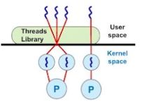
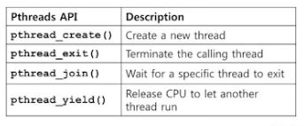
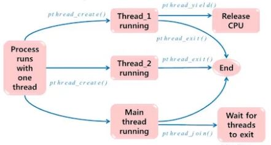
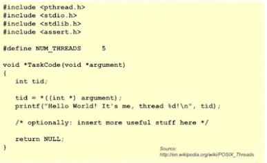
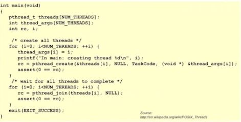

# Multithreading(4)

## Threads Implementation : Combined UL/KL Thread
### Key entity
 + User-level thread
  - Kernel is mostly unaware of the existence of threads
  
 + Kernel-level-thread
  - Serves as virtual processor to use-level threads
  - Schedulable entity
  
 + Threads library
  Contains Code for 
  - Creating / destroying user-level threads
  - Scheduling thread execution
  - Saving and restoring thread contexts
  - Passing messages and data between threads
  
  
### System call API and kernel functions for thread facility
 + Code for
  - Creating / Destroying kernel-level threads
  - Mapping / Unmapping between user-level and kernel level threads
  - Maintaining context information for processes and threads
  - Switching between threads
  - Scheduling threads
  
  
### Processor
 + Allocation on a thread basis
 
 
  
  
  
  
## Pthreads Programming Model
### Pthreads : POSIX standard for threads
 + Defines an API for creaing and manipulating threads
 + Implementations of the API are available on many Unix-like OSes such as Linux and Mac OS X
 
 * POSIX (Portable Operating System Interface)
  - 다양한 UNIX 계열 운영체제들의 API를 표준화하기 위해 IEEE가 정의한 인터페이스
 
 
### Selected Pthreads functions

  
  
  
+ create() 의 argument로 그 thread가 수행해아할 code가 제공되어야함
  C의 함수 pointer로 전달됨
  
  - 쓰레드가 생성되면 쓰레드의 entry pointer는 특정 함수가 된다

  - 그 entry pointer의 함수의 function pointer가 pthread_create()에 제공된다
  
  

### Thread life cycle

  
  
  
- 다른 쓰레드들이 수행되고 있을때 main thread 는 이 쓰레드들을 monitoring함
 
  (종료를 기다림 by. pthread_join())
  
- pthrad_yield()를 호출한 쓰레드는 어떤식으로 수행이 재개되는가?
 
 > pthread_yield()에 의한 쓰레드의 상태 변화는 운영체제에 의해 관리된다.
 
 > User Code 상에서는 pthread_tield()의 호출 지점에서 정지되는 것으로 보이며,
 
 > 쓰레드가 다시 cpu를 할당받으면 다음 Statement부터 수행을 재개한다.
  

### Example code

  
  
  
  
  
  - user-level / kernel-level thread implementation 차이
   : user-level 은 pthread_create()가 user level library 함수여서,
   이 program이 컴파일되고 링크될 때 그 library가 링킹이 되어서 하나의 이미지로 수행됨
   : pthread library 가 kernel-level 인 것은 system call을 의미함
  
