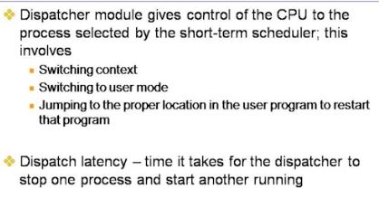

# Basic Concepts

## Resource Scheduling in Gerneral
### Until now, you have heard about processes
 + Process implementation
 + Process dispatching
 
 
### From now on, you'll hear a lot about resources
 + Resources are things operated upon by processes
 + Example : CPU time, disk space, network channel time
 
 
### Resources fall into two classes
 + Preemptible : 한 프로세스가 점유한 상태에서 다른 프로세스에게 양보할 수 있는 자원 (CPU..)
  - Can take resource away, use it for something else, then give it back later
  - Examples : Processor or disk
  
 + Non-preemptible : 한 프로세스가 점유하면 사용을 마칠 때까지 다른 프로세스에게 양보할 수 없는 자원
  - Once given, it can't be reused until process gives it back
  - Examples : File space, terminal
  - Distinction is a little arbitary, like (non-)breakable

### OS makes two related kinds of decisions about resources
 + Who gets it next? 누구에게 줄 것인가
  - Given a set of requests for a resource, which processes should be given the resource
    in order to make most efficient use of it?
    
 + How long can they keep it ? 얼마나 오래 사용하도록 할 것인가
  - When more resources are requested than can be granted immediately,
    in which should they be serviced?
    
  - Examples 
   > Processor scheduling : One processor, many processes
   > Memory scheduling in VM preemptible
   
  - Implication is that resource is preemptible
  
  
## CPU Burst : 프로그램의 수행 중에 연속적으로 CPU를 사용하는 단절된 구간
### In multiprogramming, OS alternates code execution and I/O Operations to maximize CPU utilization
  + CPU-I/O burst cycle
   - Process execution consists of a cycle of CPU execution and I/O wait
   - CPU burst distribution varies significantly
   

### "CPU burst" is the entity participating in CPU scheduling in most modern operating systems

* Batch Monitor에서의 Job
 - 한번 수행이 시작되면 완료될 때까지 계속 수행되는 작업
 
 
### Alternating CPU and I/O bursts

 
 
 
 * I/O Burst : 프로그램의 수행 중에 I/O의 완료를 기다리며 블록되는 구간
 
 
### Histogram of CPU burst times

 
 
 
 - cpu burst 의 size에 따라서 스케쥴링 기법이 달라져야함
 
 - cpu intensive한 연산들은 burst 사이즈가 큼
 
 - i/o interactive, touch screen 처리 등은 burst 사이즈가 작음
 
 

## CPU Scehduler
### Select one among the processes in memory that are ready to execute and allocates the CPU to one of them

### CPU scheduling decisions may take place when a process
 1. Switches from running to waiting state
 2. Switches from running to ready state
 3. Switches from wating to ready
 4. Terminates
 
  + Scheduling under the 1st and 4th is non-preemptive
  + All other scheduling is preemptive

### Process scheduling = process state transition
 
 
 
 

 - running 에서 ready로 갈 때는 반드시 hw interrupt를 통해야함 > scheduler가 개입해서 강제로 cpu를 빼앗음
 - wating에서 ready로 가는 거(preemptive의 한 부분. 비동기적 event가 발생해야함)
 - > preemptive 스케줄링
 
 - running 에서 waiting 으로 가는건 non-preemptive 스케줄링
 - running에서 terminate로 가는거
 - 자기 스스로 cpu-yield 함수를 호출해서 wating으로 감
 
 
### Dispatcher 
 
 
 
 
 