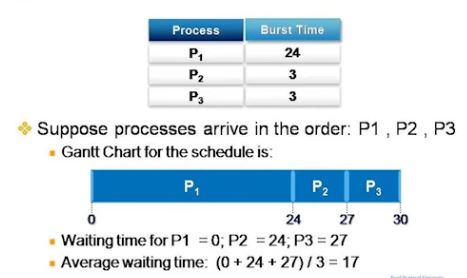
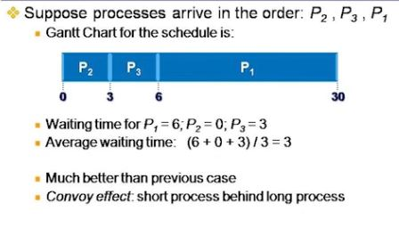
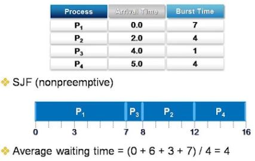
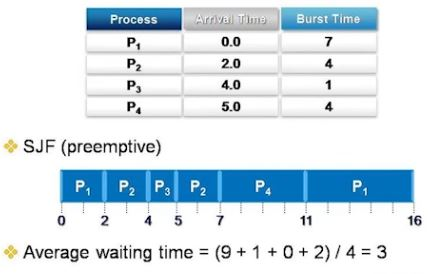
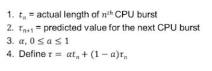
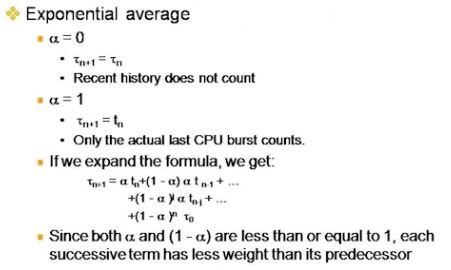

# Scheduling Policies(1)

## Scheduling Objectives
### Maximize resource utilization
 + Keep the CPU and I/O devices as busy as possible
 
### Minimize overhead
 - OS가 스케줄링하려면 CODE가 수행(의사결정) 되어야 하고 그 양이 적어야 한다

### Minimize context switches
 - 너무 빈번하게 스케줄러가 동작하면 컨텍트 스위칭이 많아짐

### Distribute CPU cycles equitably

* Aging : 태스크가 cpu를 기다리는 시간에 비례하여 우선순위를 점차적으로 높이는 기법

### Throughout
 - # of processes that complete their execution per time unit
 

### Turnaround time
 - Amount of time to execute a particular process
 
 
### Waiting time
 - Amount of time a process has been waiting in the ready queue

### Response time
 - Amount of time it takes from when a request was submitted until the first 
   response is produced, not output(for time sharing environment)
   
   
 * Thoughout 과 Response time의 밸런스를 맞추는 것이 중요하다 
 

## Scheduling Policies
### Policies used by the CPU scheduler

### Scheduling disciplines
 + FIFO(FCFS), RR, SJF, MLFQ(EQ), etc..
 
 
## First In First Out
### Key ideas
 + Let the first one run until finish
 
 + Also called First Come Fist Served(FCFS)
 
 + In the simplest case, this means uniprogramming
 
 + Usually, "finished" means "blocked"
  - One process can use CPU while another waits on a semaphore
  - Go to back of run queue when ready
  
 + Problem 
  - One process can monopolize CPU
  
 + Solution (OS 개입)
  - Limit maximum amount of time that a process can run without a context switch
  - This time is called a "time slice"
  
  
  * Job Scheduling 관점에서 FIFO 는 non-preeptive 스케줄링
    Process Scheduling 관점에서는 단위가 cpu burst(다음 I/O를 할때까지)이고 preemptive 스케줄링
    

 
 
 
 
 
 

 - CPU Burst time을 먼저 수행시키는게 제일 효율적이다
 
 > Shortest Job FIrst 알고리즘 
 
 but 문제도 있음 : OS가 테스크의 남은 CPU Burst Size 예측할 수 없음
 

## Shortest Job First
### Key operations
 + Associate with each process the length of its next CPU burst
 + Use these lengths to schedule the process with the shortest time
 

### SJF is optimal
 + Gives the minimum average waiting time for a given set of processes

### two variations : 존재하지 않지만 cpu burst size를 다 알고있다고 가정
 + Nonpreemptive
  - Once CPU is given to a process, it cannot be preempted until it completes its CPU burst
  
  
  
  
  
 + Preemptive
 
  - 현재 수행 중인 테스크가 종료될 때 / 새로운 테스크가 생성되거나 깨어날 때
 
  - If a new process arrives with CPU burst length less than remaining time of current executing process, preempt it
 
  - This scheme is know as the Shortest Remaing Time First (SRTF) Or Shortest Time to Completion First(STCF)
  
  
  
  
  
### Challenge : Predicting the next CPU burst size
 + Can only estimate length
 + Exponential average
  - Can be done by using the length of previous CPU bursts, using exponential averaging
  

  
  
  
  
  
  
  > 알파 값을 크게하면 recent history 작게하면 예전 history 보면서
    cpu burst size를 예측하는것
    
  > 알파 값은 찾는게 불가함 (개념적 툴만 적용)

## Round Robin
### Key ideas
  + Run a process for one time slice
  + Then move it to the back of queue
  
  + Each process gets equals share the CPU
  + Most systems use some variant of this
  + What happens if the time slice isn't shosen carefully?
   - Too long : A process can monopolize the CPU
   - Too short : Too much context switch overhead
  
  
>> 기본적으로 FIFO 이지만 스케줄링에 time-out 값이 있어서
   time-out값보다 현재 cpu_burst size가 크면 수행을 강제로 종료당하고 ready queue의 제일 뒤로 이동
   
   
>> Time-out 값을 얼마나 해야하는가 ?

* RR 스케줄링에서의 Time Slice(Time Quantum)
 - 테스크에게 cpu가 할당된 후 다음 스케줄링을 위한 Timer Interrupt가
  발생할 때까지의 시간

  - Time_out값이 무한대면 FIFO가 되고
   0 이면 엄청 정확한 알고리즘이지만 Interrupt가 너무 많이
   발생하고 ISR이 너무 많이 수행되니까 overhead가 너무 커짐
  
  