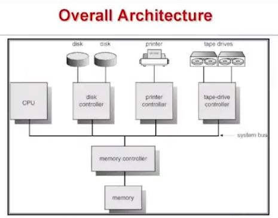

3.Review of Computer Hardware
=============================

# Computer Systems Architecture
## Overall Architecture

- System Bus : HW 요소들(cpu, 메모리, i/o devices) 을 연결시키는 기법이나 요소

## System Interconnect
### System Bus
- consists of two types of buses
 + Data bus
  ++ Data pathway between bus master and slave
  
 + Address Bus
  ++ data의 소스나 목적지 address를 전달함
  ++ Specifies the target location of data transfer
  
- Two types of bus transactions
 + read / write
 
- Bus arbiter
 + 여러 Bus Master들이 서로 Bus를 장악하려고 할 때, 특정 Bus Master에게 Bus를 제공해주는 조정자
 + Accepts bus request signal(from bus master) 하고
 + Replies with bus grant signal -> 우선순위 높은 것이나 어떤 정책에 의해서 해당 Bus master에게 Bus 제공

### Bus Master
- Read/Write 트랜잭션을 시작할 수 있는 요소
- cpu, i/o controller, dma controller 가 대표적인 요소

- Can initiate bus transaction by sending bus request signal
- transaction : (read or write)  먼저 Bus 장악해야함
                Computer system 안에는 bus 트랜잭션을 시작할수 있는 master가 여러개 있기 때문 
                
- CPU : Moves data between main memory and cpu registers
- DMA Controller : moves data between main memory and i/o buffer 'without the help of CPU'

### Bus Slave
- main memory가 대표적인 요소

- data를 담고있는 장치이고 여러 data를 담고 있으니 address가 필요함

- Takes command from bus master and serve it accordingly

- i/o 연산 시 interrupt driven i/o를 해서 bus controller가 주도적으로 i/o할 수 있지만
  cpu가 할 수도 있음 -> 이 경우 i/o controller들도 bus slave가 될 수 있다
  
- i/o controller 가 data를 담고 있는 장치(bus slave)인가?
 + 정확히 말하면 i/o controller 안에 들어있는 buffer memory나 register 들이 bus slave이다

- memory controller (memory)
- I/O device controller (Slave도 가능함)

 Q. momory와 i/o device 에 있는 address들은 형태에 차이가 있을까?
 
  + 이 둘은 address 구현방식에 따라 주소의 형태를 같거나 다르게 만들 수 있음
   ++ 다르게 구현하는 경우 ? memory address 일정 영역에 빈 공간 만들고 address bus에 그 공간을 가리키는
                        주소가 전달되면, momory에 cell들을 access하게 하는 대신 I/O Device에 있는 
                        register를 access 하게함
  
  + In charge of a particular device type
  
  + Has local registers and/or local buffer
  
  + Inform CPU that it has finished its operation by causing interrupt
   ++ Note that i/o devices and cpu can execute concurrently
   
  + I/O is from the device to local buffer of controller
  
  
### I/O Device controller
- register 나 Buffer 안에 data가 있으면 실제 i/o device로 출력함
- 자기 input register가 비어있으면 i/o device에서 data를 읽어옴

- Has regsiter
 + Data Registers : input / output register
 + Control register, control register, status register
 
- I/O operation initiated by CPU
 + Output operation
  ++ Check if output register is available by reading in status register
  ++ If so, move data to output register, move output command to control register
  ++ Otherwise, either repeat this process or wait until output register is available

 + Polling I/O vs Interrupt-driven I/O
  1 Interrupt-driven I/O
   ++ I/O 동작이 완료되면, I/O Controller가 CPU에게 완료되었음을 비동기적으로 알려주는 방식
   ++ I/O 연산과 CPU 동작이 오버랩 될 수 없음
  
  2 Polling I/O
   ++ I/O 동작이 완료될때까지 , CPU가 반복해서 I/O Controller의 register 상태를 확인하는 방식(무한 loop)

### Two types of I/O addressing
1. Memory-mapped I/O 
 : main memory의 주소공간 일부를 할애해서 그곳에 I/O register들을 mapping 하는 방식

 + I/O registers sre associated with memory locations
 + Uses the same address bus to address both memory and I/O
 + Uses Load/Store instructions for Input/Output (별도의 I/O 연산 instruction 필요 없음)
 
 + ex) 모토로라 Miroprocessor
 
2 Port-mapped I/O 
 : memory address 와 port address 구별하는 방식

 + I/O registers are associated with special I/O addresses port numbers 
   (port numbers != memory address space)
  ++ Has separate I/O address space
 + Uses special I/O Bus
 + Uses special Input/Output instructions(target 주소는 register의 주소)
 
 + ex) 인텔 Miroprocessor
 
 >> 여기까지는 다뤘던 interrupt, polling..들은 Character I/O 연산 
 >> Data Transfer Unit이 1 or 2bytes 정도의 한 Character
  

### DMA(Direct Memory Access)
- cpu의 개입 없이 I/O Controller가 Memory에 직접 접근하여 data를 read/write하는 기능
- 'Block data'를 옮길떄 cpu 간섭을 최소화하기 위해 사용
- byte 단위로 계속 I/O가 수행되면 속도가 느림 
  (하나 수행 완료되면 Interrupt 가 걸리고 Interrupt handler 코드 수행되어야 하기 때문)
 
 + Allows device controller to directly transfer block of data between buffer storage and main 
   memory without CPU intervention

- DMA Controller가 CPU에게 Operation command, block의 시작주소, block의 크기를 제공받고
  block에 있는 data를 옮김 (cpu의 간섭은 없음)
  
- DMA Controller가 block data를 옮기려면 매번 data bus에서 한 word 씩 가져올 떄마다 bus를 장악해야함
 + Bus master로써 bus arbitration 과정을 통해 bus를 장악하고 한 word 씩 메인 메모리에서 직접 read
 + 자기 buffer 에 잠깐 보관후 I/O Device로 전송
 => Controller가 메모리에 바로 access 하여 "Direct Memory Access" 라고함
  
- block data 전송이 다 끝나면 dma controller는 cpu에게 종료 사실을 알려야함
 => "인터럽트" 사용

 + Only one interrupt is generated per block, rather than the one interrupt per byte
 + Used for high-speed I/O devices able to transmit information at close to memory speeds

 
#### DMA가 Block data를 전송하는 방식
- Cycling stealing 
 + CPU가 BUS를 사용안할 때(idle) DMA Controller가 Bus를 사용하는 방식
  (BUS 사이클을 하나씩 훔쳐서 데이터를 WORD 단위로 옮겨감)
 + cpu 성능에 영향 X, DMA 연산시간 증가
 
 + Cycle Stealing 기법을 사용할 경우에도 Interrupt 필요함
  ++ DMA 역시 I/O가 완료되면 Interrupt를 사용해서 I/O를 요청한 프로세스에게 CPU를 넘겨준다
 
- Block Transfer
 + CPU와 DMA Controller가 대등하게 경쟁하여 Bus를 사용하는 방식
 