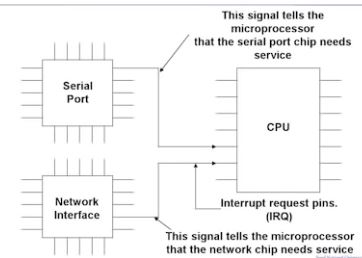
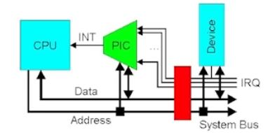

# Interrupt Mechanism
## Interrupt
 - HW Mechanism that transfer control to interrupt service routine(ISR)
 
 
## Types of Interrupts
### HW Interrupt
- caused by hw signal
- Asynchronous

### SW Interrupt ( trap 이라고 부르기도함 )
- caused either bya an error or instruction
- Synchronous

## OS is interrupt driven

## Interrupt mechanism
### At the time of interrupt
- Microprocessor의 특정 pin(interrupt source가 물려있음)이 interrupt signal을 수신함
- Interrupt source : CPU에게 Interrupt를 날려야하는 hw 유닛들
  ex). I/O Device Controller, DMA Controller

1 Stops the execution of the current program
 현재 Instruction는 완료하고 지금 돌고 있는 프로그램 중단 

2 Saves the address of the interrupted instruction 
 마이크로 프로세서의 프로그램 카운터(PC)값(돌아올 주소 값) 을 안전한 곳에 저장
 
3 Gets the address of ISR via interrupt request(IRQ) number and interrupt vector table
 Interrupt Request Number(Interrupt vector table의 index로 작용)를 통해 Interrupt Source 확인
 Interrupt vector table에는 Interrupt handler 주소가 저장되어있음
 
4 Jumps to the ISR
 ISR의 주소를 찾아서(handler의 주소) handler로 점프사여 ISR 수행
 
5 ISR 끝나면, 저장되어있는 Interrupt 되었던 프로그램의 시작주소로 다시 복귀함

## Interrupt destination
- Microprocessor has input pin called Interrupt Request(IRQ) that let the Microprocessor know
  that some other chip in the system needs attention

- Interrupts start with a signal from HW

## Interrupt Source
- I/O chip has a pin that it asserts when it requires service

-> 좋지 않은 구조임. 경우에 따라 Interrupt Source 개수가 다를 수 있으므로 pin 개수도 많아야한다.
-> pin cost가 비싸다 
-> Scalability problem 발생 ! CPU가 확장성을 감당하지 모함
-> PIC 등장
-> interrupt source 와 microprocessor 사이에 hardwired 된 연결이 아닌 programmble한 것이 PIC

## PIC(Programmable Interrupt Controller)
- Functions as an overall manager in an interrupt 
- Can support more I/O devices than the number of IRQ pins

- output line이 있고 여러개의 input lines들이 Interrupt Source에 연결됨(보통 16개 16bit)
 >> 만약 설계한 시스템의 I/O 개수가 16개보다 크면 PIC 하나 더두는 방식 생각
 >> 추가한 Interrupt Line을 기존의 PIC의 Input Line에 연결
 >> "Cascading" 방식으로 임의의 개수의 I/O Device를 모두 지원가능하게 됨

### 특정 interrupt source를 disable 시켜야 하는 경우?
- PIC 안에 각 interrupt source line 에는 한 bit 짜리 flag가 있는데 그 flag를 0으로 masking 하면 됨
- 다시 flag bit를 1로 키면 enable 됨
- 이를 sw로 구현가능하니까 programmable 함

### Interrupt Mask
- 특정 Interrupt Source가 발생시키는 Interrupt를 무시하거나 향후에 처리할 수 있도록 하는 기술
- I/O Operation으로 mask 값을 바꿀 수 있음
- Mask register의 port number(i/o address)를 target으로 하여 output operation을 함
(PIC 안에 있는 register 들은 전부 I/O Address 범위 안에 매핑되어있어야하곡 다 port address를 부여받음)

### IRQ number를 어디서 얻어오는가?
- PIC에 있는 레지스터에서 얻어옴
- 여러 인터럽트 소스들이 인터럽트를 걸면 하나의 특정 인터럽트 소스가 선택됨
- 특정 인터럽트 소스가 signal을 발생시키면 해당 IRQ Number를 PIC가 생성해서 자기 Register에 저장
- CPU는 인터럽트를 받으면 I/O address Bus를 통해서 그 IRQ Number Register를 지정하고 값 얻어온다
