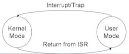

# Hardware Protection Mechnism

- Privileged Instruction : OS만 수행할 수 있는 Instruction

## Dual Mode Operation
### Motivation
- Sharing system resources requires OS to ensure that an incorrect program cannot cause
  other programs to execute incorrectly
  
### Key idea
- Provides hardware support to differentiate between at least two modes of operations
 + User mode
  ++ Execution done on behalf of a user
  
 + Kernel mode (system or monitor mode)
  ++ Execution done on behalf of OS
  ++ When executing in kernel mode, OS has unrestricted access to both kernel and user's memory
  
- Mode bit added to computer hardware, particularly in processor status register,
  to indicate the current mode
  + 0 : kernel mode -> privileged Instruction들을 수행시킬 수 있는 mode 
        (privileged mode or monitor mode)
  + 1 : user mode -> privileged Instruction들을 수행시킬 수 없는 mode / 일반 프로그램은 돌아감
  
- When an interrupt or trap occurs hardware switches to kernel mode
  >> Instruction 수행을 위해서 fetch 하고 instruction을 decode 하는데 이때 mode bit를 check 한다
  >> 방금 읽어들인 instruction이 privileged instruction 인데 mode bit가 1인 상태일 경우 수행 거부해야함
  >> 누군가가 Protection을 침해하려하니 SW Interrupt(trap)을 발생시켜서 해당 프로그램 수행을 막는다

- Provides special instructions called privileged instructions 
  which can be executed only in kernel mode
  
  
  

- USER Program은 기본적으로 malicious 하다고 간주함 
  >> 프로그램은 반드시 BUG 가 존재하니까 Computer System에 악영향 미칠 가능성 있음 
  >> 통제된 환경에서만 수행시켜야함 
  >> 모드가 존재하는 이유
  >> (but "OS 는 신뢰성 있다고 말할 수 있음")

- 'Operation System'이 커널 모드에서 수행될 때 부여받는 주요 권한
 + Privileged Instruction을 수행시킬 수 있는 권한
 + 모든 메모리 영역에 접근할 수 있는 권한

- Kernel Privilege가 필요한 경우?
 + kernel mode에서 수행되는 OS가 mode change를 담당하게 하자 !
 
 + User mode에서 kernel mode로 바뀐다 ? 
   User program이 큰 권한을 받게되는거라, 이를 control할 system이 kernel mode에 있어야함 !
   (현재 user mode에 있고 kernel mode 권한이 필요한데 이를 위해서는 os가 수행되어야한다.
    현재 usermode에 있는데..? "모순적임" )
   
 + 'Interrupt Instruction' 수행하여 하드웨어적으로 무조건 mode bit를 1 -> 0 으로 바꿔줌
 
 + Interrupt Instruction은 SW Interrupt 이지만 interrupt handler 나타남 
   -> handler는 user 의 권한을 바꿔주는 함수이다
   
 + 커널 모드로 바뀌는 순간 mode change를 관할할 수 있는 ISR이 시스템을 장악
 
 + user 가 mode change를 요청했지만 통제된 환경에서 시스템이 관리됨 !

## System Call
- 좀 더 체계화된 privilege의 변환을 얻을 수 있도록 함
- A way of user program invoking a hernel function in kernel mode
- Always involves mode change from user to kernel mode
- Compare it with function call

>> Process에서 더 자세히 다룸

## I/O Protection
### Motivation 
- To prevent I/O devices from being monopolized
  한 Job이 I/O register에 마음대로 access해서 I/O(자원)를 독점하면 System의 효율성에 문제가 생김

### Key idea
- All I/O instructions are privileged instructions
  I/O register access를 Privileged instruction으로 만들면 보호할 수 있다
  >> I/O 관련 모든 함수들은 Kernel 내부로 들어가야한다 !
  
  + Must ensure that a user program can never gain control of the computer in kernel mode
  + Example 
   ++ A user program that, as part of as its execution, stores a new address in the interrupt vector
   

## Memory Protection

## CPU protection
